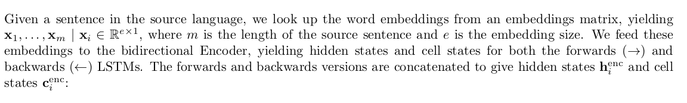
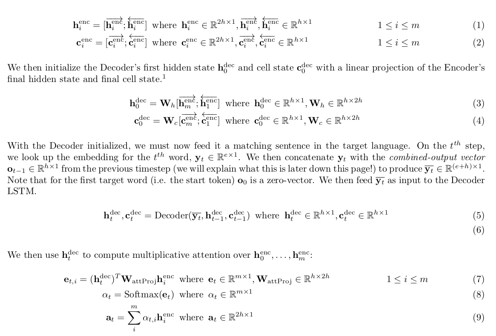
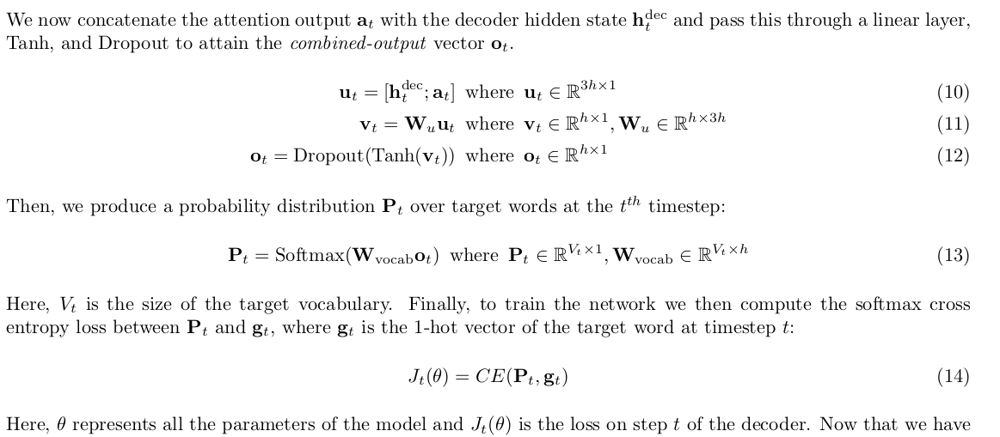

# machine_translation
This project has been slightly adapted from an assignment in Chris Manning's class at Stanford called Deep Learning for NLP, aka  XCS224N. 

The goal of the assignment was to perform a Cherokee-to-English translation task, as originally described in [Zhang et al (2020)](https://arxiv.org/abs/2010.04791)

Note: Code was heavily inspired by the https://github.com/pcyin/pytorch_nmt repository

The assignment builds a Neural Machine Translation (NMT) system with a Seq2Seq network with attention. The following description for training the model is very math heavy, so I've copied it directly from the assignment itself:



The code that I actually implemented includes the following:
```buildoutcfg
pad_sents() from utils.py
__init__() from model_embeddings.py
from nmt_model.py:
__init__() 
encode() 
decode() 
step()
```

The model requires a gpu for training. To generate the vocab file, run the following:\
```sh run.sh vocab```\
On your GPU machine, and with the GPU conda environment activated, you can train the model as follows:\
```sh run.sh train```\
To test the model, run:\
```sh run.sh test```

